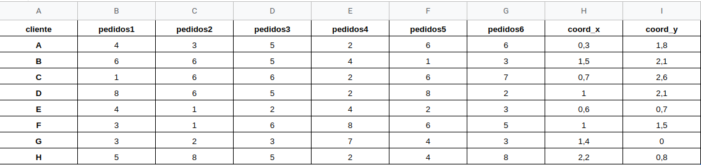

# Datos de Input

El modelo requiere el siguiente formato en el excel para definir los datos de pedidos y camiones. Además permite definir desde este excel algunos parámetros del ruteo como el costo de oportunidad y el presupuesto.

El excel debe contener las siguientes 4 hojas con los siguientes nombres:

## pedidos

Esta tabla puede contener cualquier número de columnas de pedidos. Debe contener las columnas con el ID del **cliente** y su locación en las columnas **coord_x** y **coord_y**. 

## camiones

Esta tabla tiene que tener las 4 columnas mostradas, con el ID de cada camión y sus restricciones. Esto permite que cada restricción de cada camión puede variar de forma independiente. Además permite agregar nuevos camiones en forma de filas.

## parametros_ruteo

Esta tabla incorpora algunos parámetros del como el valor de los pedidos no asignados en el **costo_oportunidad** y el **presupuesto** contra el que se calcula el ahorro.

## parametros_mh

Esta tabla incorpora los parámetros de la optimización por recocido simulado.

